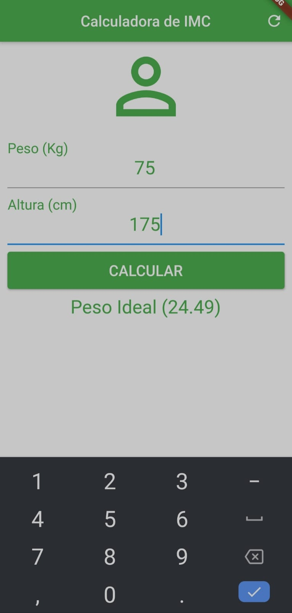
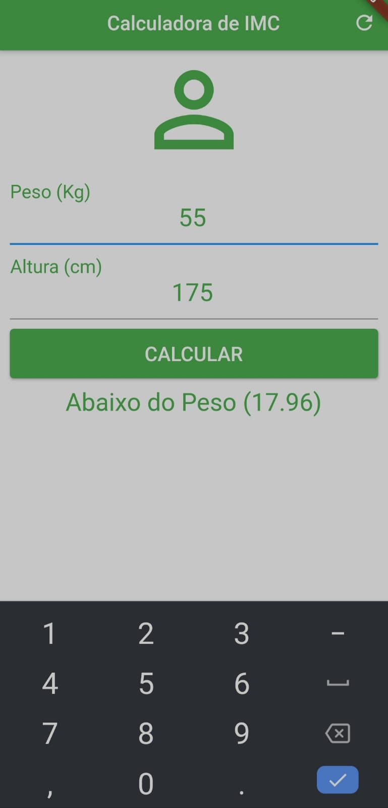

# calculadora-imc
Projeto calculadora de IMC desenvolvido com Flutter </img>

Essa é a tela inical, aqui o usuário irá digitar as informção pedidas.

Essa são algumas tela após a inserçãos dos valores (valores meramente ilustrativos).

